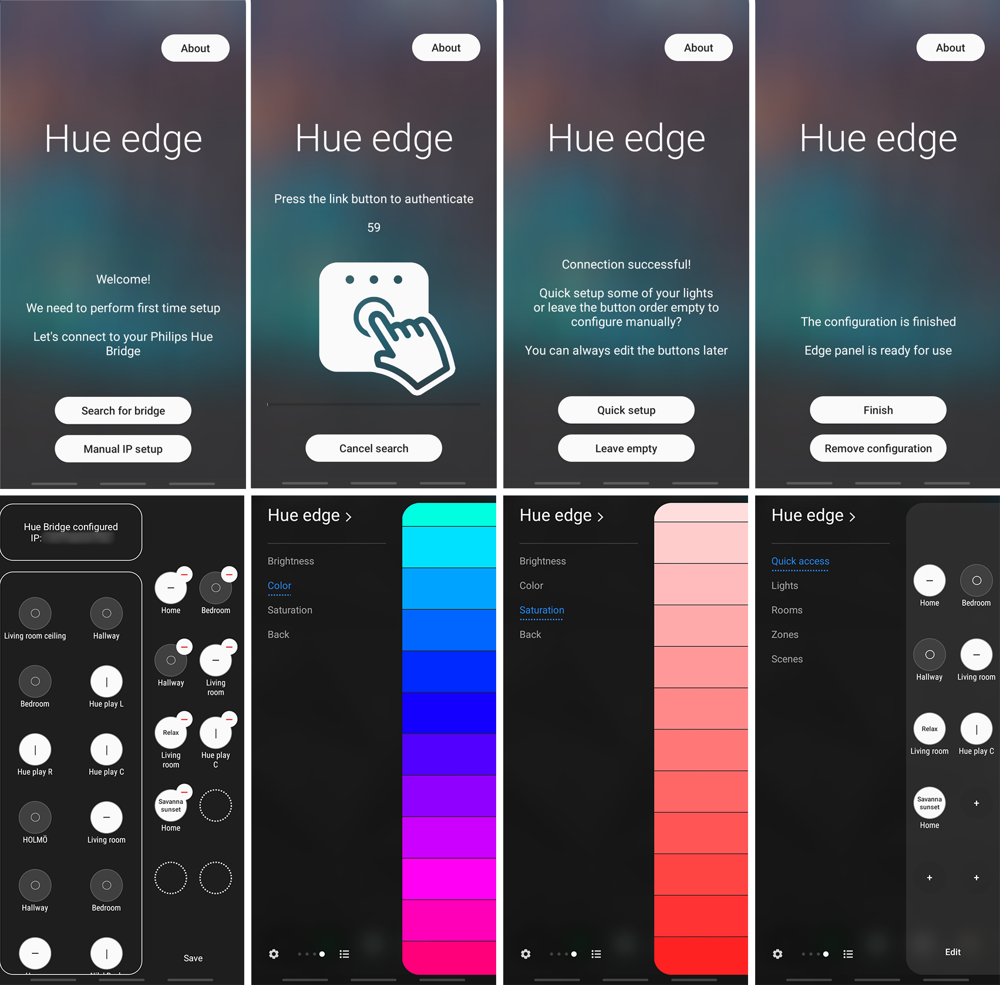

# Hue-Edge
Android (24-30) Slook SDK application for control of Philips Hue Lights via Edge panel (Cocktail panel Edge Single Plus Mode).

Hue edge - control your Philips Hue system via the edge panel

Features:
* Toggle lights, rooms, groups, zones and apply scenes via the edge panel
* Press and hold for control of the brightness, color and saturation
* Pull-down to refresh and see the status at a glance
* Guided setup helps you discover and connect to your Philips Hue Bridge
* Separate categories for different types of actions
* Add and remove buttons to your liking
* Currently limited to control of the Philips Hue Bridge on the same local network
