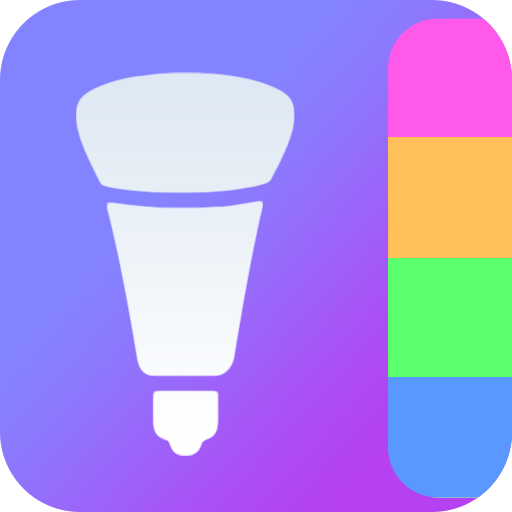
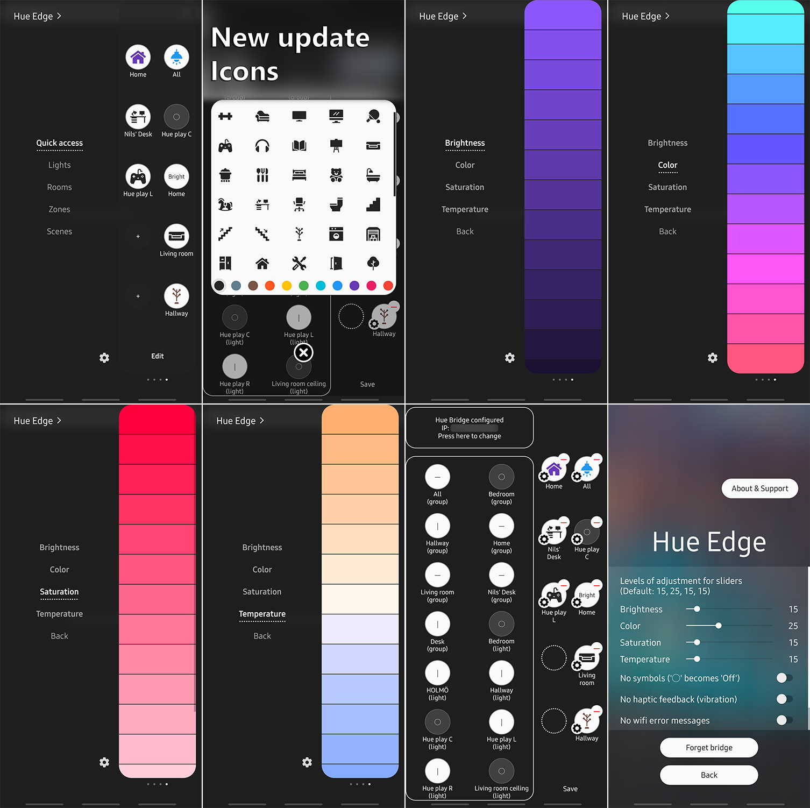

# Hue-Edge
Android (24-30) Slook SDK application for control of Philips Hue Lights via Edge panel (Cocktail panel Edge Single Plus Mode).



Hue Edge - control your Philips Hue system via the edge panel

Features:

* Toggle lights, rooms, groups, zones and apply scenes via the edge panel
* Works even from the lock screen
* Add and remove buttons to your liking
* Apply custom icons to the panel buttons
* Press and hold for control of the brightness, color, saturation, and temperature
* Pull-down to refresh and see the status at a glance
* Guided setup helps you discover and connect to your Philips Hue Bridge
* Separate categories for different types of actions
* Currently limited to control of the Philips Hue Bridge on the same local network



Developed by
========================
* Nils Trubkin (nils.trubkin@gmail.com)

License
-----------

```
Copyright 2021 Nils Trubkin

Licensed under the Apache License, Version 2.0 (the "License");
you may not use this file except in compliance with the License.
You may obtain a copy of the License at

   http://www.apache.org/licenses/LICENSE-2.0

Unless required by applicable law or agreed to in writing, software
distributed under the License is distributed on an "AS IS" BASIS,
WITHOUT WARRANTIES OR CONDITIONS OF ANY KIND, either express or implied.
See the License for the specific language governing permissions and
limitations under the License.
